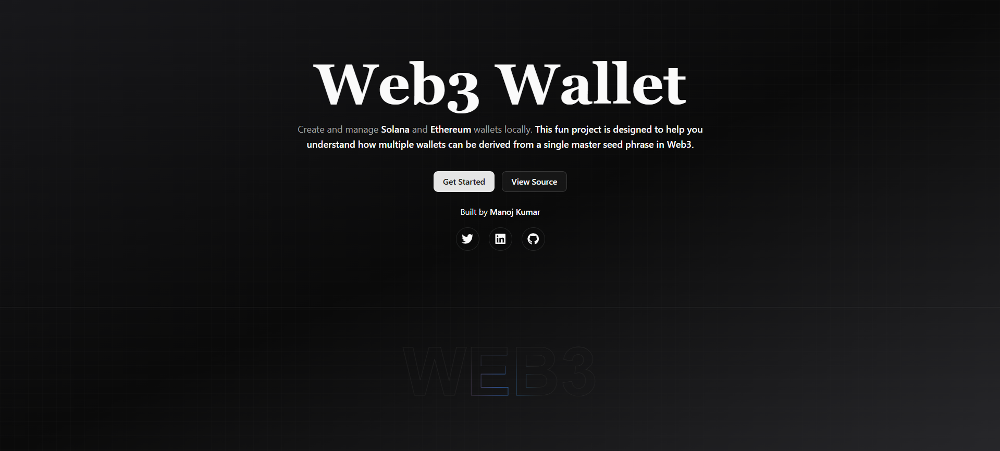
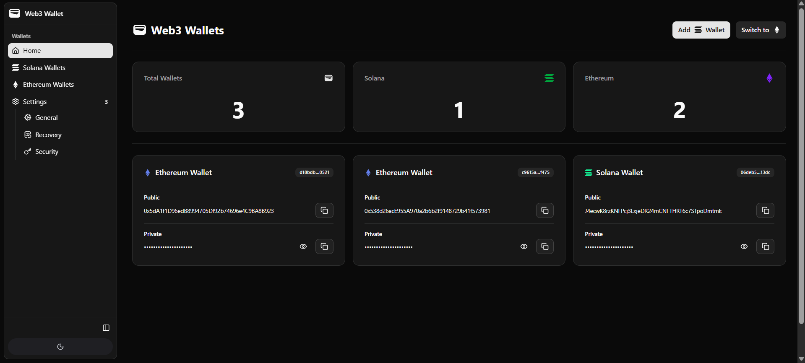
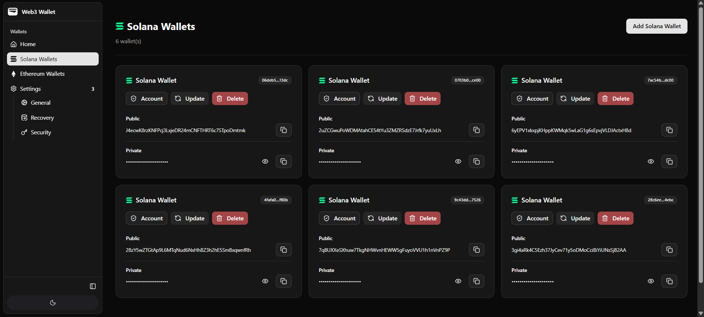
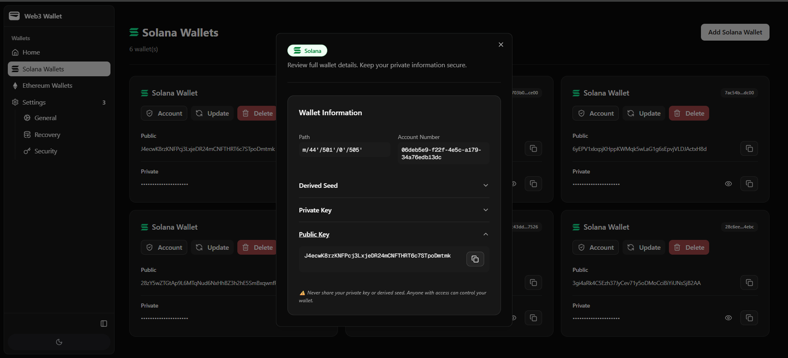
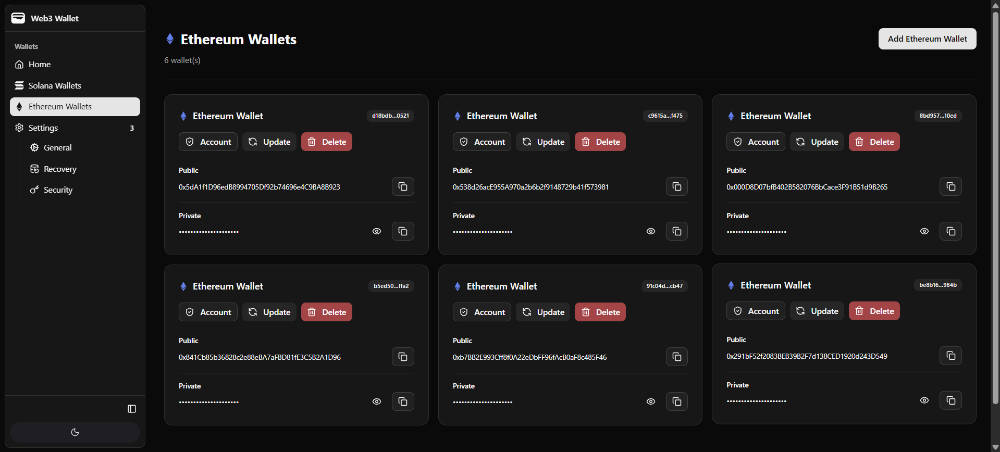
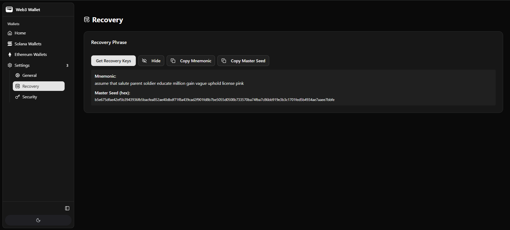
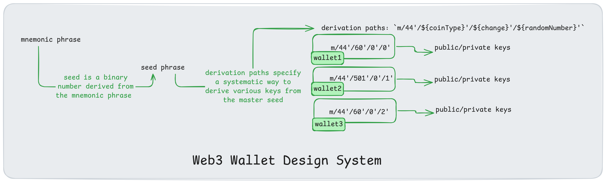
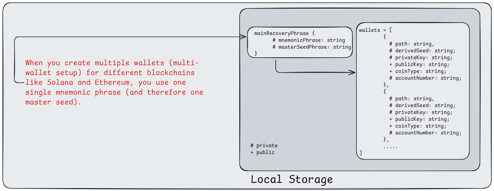

# Web3 Wallet

Create and manage **Solana** and **Ethereum** wallets locally. This fun project is designed to help you understand how multiple wallets can be derived from a single master seed phrase in Web3.

> We divided this project into 3 learning steps for better understanding how each wallet is associated with its own public and private key with extra credentials.

#### [🚀 Web3 Wallet Demo](https://web3walletv1.vercel.app) | [📗 Excalidraw Visual Flow](https://excalidraw.com/#json=UelRXVqXj3_37Bo2c5B3x,Nzf6NJMDH7aH20kJBv374w) | [🙏 Give Your Feedback](linkedin.com/feed/update/urn:li:ugcPost:7383034304064471040)








## Learning Steps

1. [Create the private/public key](#1-create-the-privatepublic-key)
2. [Generate multiple wallets from a single mnemonic](#2-generate-multiple-wallets-from-a-single-mnemonic)
3. [Full-stack app (Next.js + ShadcnUI) and local storage](#3-full-stack-app-nextjs--shadcnui-and-local-storage)

---

## 1. Create the private/public key

Learn how to generate a private and public key pair from scratch for Ethereum and Solana.

- Ethereum: Uses **ethers.js**
- Solana: Uses **@solana/web3.js**

```bash
npm install ethers @solana/web3.js
```

## 2. Generate multiple wallets from a single mnemonic

Understand hierarchical deterministic (HD) wallets and how multiple accounts can be derived from one mnemonic.

### Example (Solana)

```ts
import { Keypair } from "@solana/web3.js";
import nacl from "tweetnacl";
import bs58 from "bs58";

// 1. Generate a new keypair
const keypair = Keypair.generate();

// 2. Extract the public and private keys from keypair
const publicKey = keypair.publicKey;
const secretKey = keypair.secretKey;

// 🔥 Important Step: Convert both keys to base58 string format for human reading friendly
const publicKeyEncoded = bs58.encode(publicKey.toBytes());
const secretKeyEncoded = bs58.encode(secretKey);

// 3. Define a message & convert the message "hello world" to a Uint8Array
const defineMessage = "hello world";
const message = new TextEncoder().encode(defineMessage);

// 🔥 Important Step: Decode both keys from base58 string to Unit8Array format
const publicKeyDecoded = bs58.decode(publicKeyEncoded);
const secretKeyDecoded = bs58.decode(secretKeyEncoded);

// 4. Sign the message "hello world" using private key
const signature = nacl.sign.detached(message, secretKeyDecoded);

// 5. Verify the signed message using public key through TweetNaCl (Networking and Cryptography library)
const result = nacl.sign.detached.verify(message, signature, publicKeyDecoded);
```

---

### Example (Ethereum)

```ts
import { ethers } from "ethers";

// 1. Generate a random wallet
const wallet = ethers.Wallet.createRandom();

// 2. Extract the public and private keys from wallet
const publicKey = wallet.address;
const privateKey = wallet.privateKey;

// 🔥 Important Step: Convert both keys to base58 string format (We don't need to this step)
// In Ethereum, the public key is typically represented as an address, which is already in a human-readable format
// The private key is already in hex string format, which is also human-readable

// 3. Define message "hello world" ()
const message = "hello world";

// 🔥 Important Step: Decode both keys from base58 string to Unit8Array format (We don't need to this step)
// In Ethereum, the keys are already in a suitable format for signing and verification
// The private key is used directly for signing, and the address is used for verification

// 4. Sign the message using the wallet's private key
const signature = await wallet.signMessage(message);

// 5. Verify the signature using wallet's public key
const recoveredAddress = ethers.verifyMessage(message, signature);
```

## 3. Full-stack app (Next.js + ShadcnUI) and local storage



Create a browser-based full-stack application using **Next.js** and **ShadcnUI** to generate and manage local Solana & Ethereum wallets.

### Steps

0. Create the understanding with local storage



1. Initialize Next.js project:

   ```bash
   npx create-next-app web3-wallet
   cd web3-wallet
   ```

2. Install dependencies:

   ```bash
   pnpm add ethers @solana/web3.js bip39 tweetnacl ed25519-hd-key
   ```

3. Add ShadcnUI components:

   ```bash
   npx shadcn-ui@latest init
   ```

4. Store wallet data securely in `localStorage` (for learning only **not for production**).

---

## 📦 Tech Stack

- **Frontend:** Next.js 15, TailwindCSS, ShadcnUI
- **Blockchain Libraries:** ethers.js, @solana/web3.js
- **Utilities:** bip39, tweetnacl, ed25519-hd-key

---

## ⚠️ Disclaimer

This project is for **educational purposes only**. Do **not** use it to store real funds. Always handle private keys securely.
